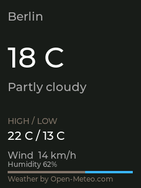
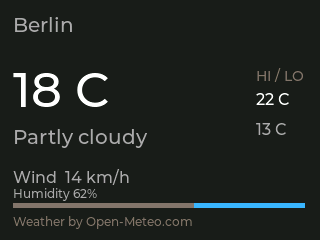
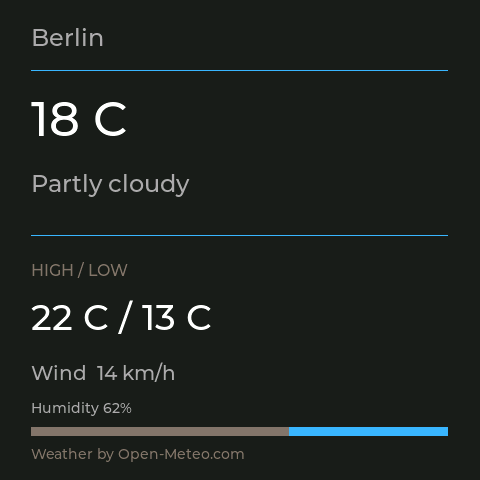

# AI Monitor Weather plugin

An independent weather view for the [AI Monitor](https://github.com/tobymarks/esp32-ai-monitor)
ESP32 companion display. This repository contains the plugin package and its
source manifest. It is separate from the companion application's plugin manager.

The plugin is declarative: `weather.aimplugin` is a ZIP containing only
`plugin.json`. It runs no third-party code on the computer or ESP32. The
companion fetches current conditions from [Open-Meteo](https://open-meteo.com/en/docs)
over HTTPS and sends a bounded drawing scene over USB. Updating this plugin
does not rebuild or reflash firmware.

## Install

1. Use a Mac or Windows AI Monitor build with the **Plugins** tab and firmware
   that reports `"sceneProtocol":1` in `get_info`.
2. In **Plugins**, choose [`weather.aimplugin`](weather.aimplugin), inspect its
   author, HTTPS data origin, checksum and unsigned state, then install it.
3. In **Display**, add **Weather** to a window and select it. Weather can also
   participate in timed window switching.
4. Set the city label, latitude and longitude in **Plugins**. The city is a
   label only; changing it does not change the coordinates. Use ASCII letters
   for the label, as required by scene protocol version 1.

The companion refreshes the assigned weather view about every 15 minutes. It
shows temperature, condition, today's high and low, wind, humidity and
Open-Meteo attribution. Portrait, both landscape orientations and the square
S3 display have separate layouts. Network errors and stale data get a visible
status screen.

## Build and validate

Python's standard library is sufficient to rebuild the deterministic package:

```sh
python3 scripts/package.py
python3 scripts/package.py --check
```

`fixture.json` contains synthetic response data. With the AI Monitor source
checkout next to this repository, validate the package using the companion's
shared plugin helper:

```sh
cargo run --quiet --locked --manifest-path ../esp32-ai-monitor/companion-windows/Cargo.toml \
  -p aimonitor-plugin-host -- inspect weather.aimplugin
cargo run --quiet --locked --manifest-path ../esp32-ai-monitor/companion-windows/Cargo.toml \
  -p aimonitor-plugin-host -- render weather.aimplugin - all fixture.json
```

The synthetic response was also rendered with the firmware's native LVGL code
at 240x320, 320x240 and 480x480. Preview images:





These previews do not prove panel output, touch or USB timing. Record the real
device result with [the hardware checklist](docs/hardware-test.md) before
calling the plugin finished.

## Data source and trust

The plugin requests current weather, humidity and today's high and low from
Open-Meteo only while its view is assigned. It needs no API key, location
permission or ESP32 Wi-Fi connection. Latitude and longitude appear in the
HTTPS request made by the companion.

Open-Meteo's [free API terms](https://open-meteo.com/en/terms) restrict free use
to non-commercial projects and require attribution. The weather scene displays
"Weather by Open-Meteo.com". The package is currently unsigned; the companion
shows its SHA-256 checksum during inspection and checks it again at install.
